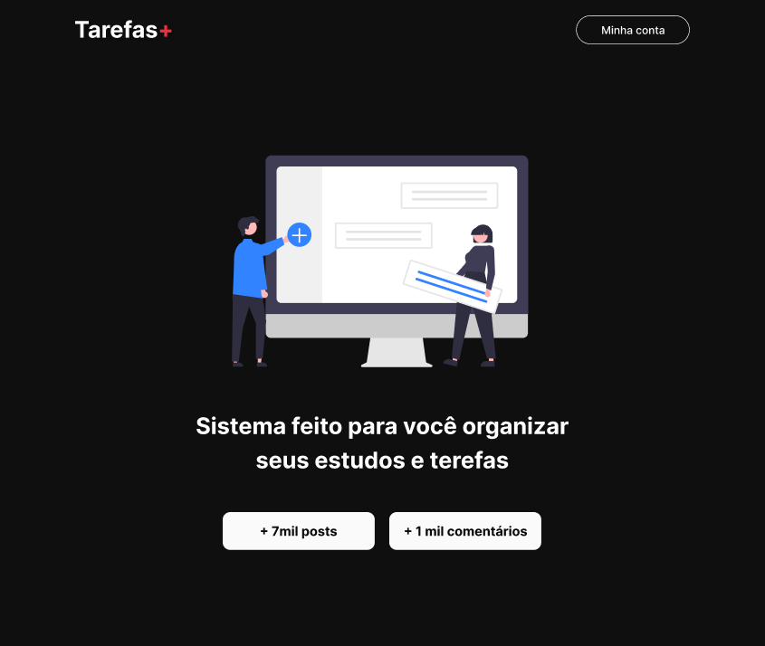
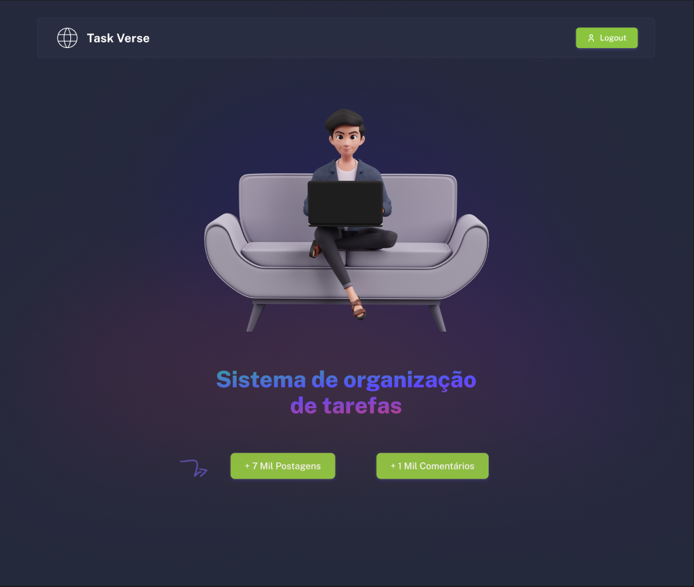
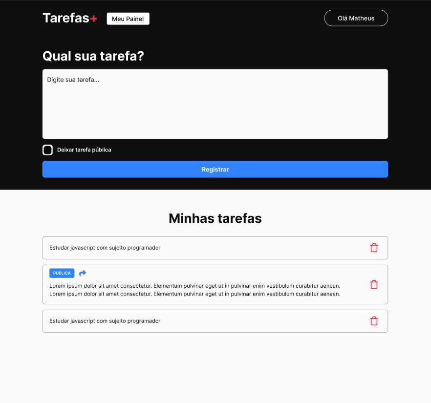
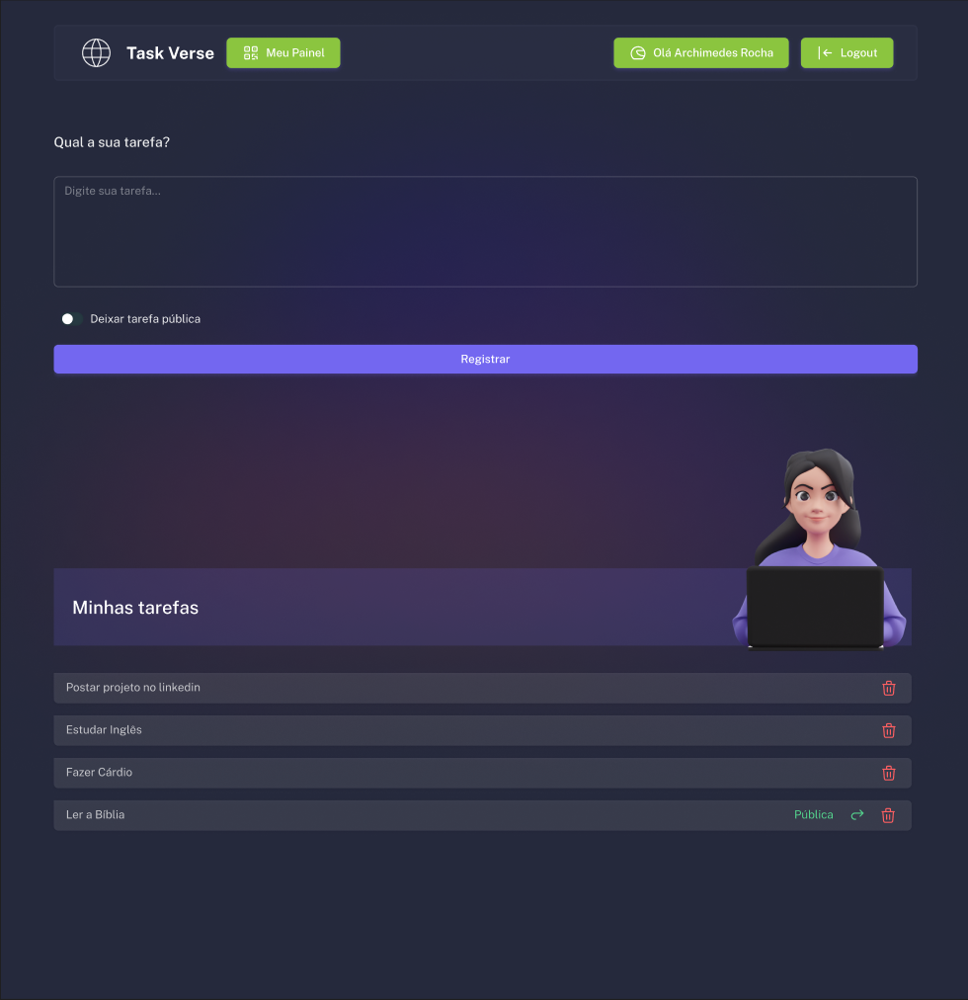
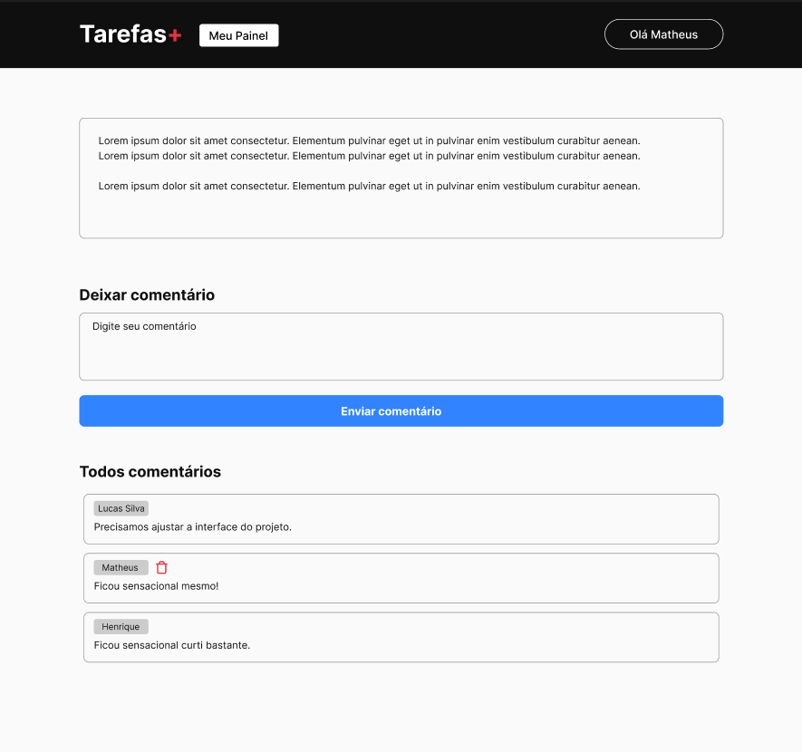
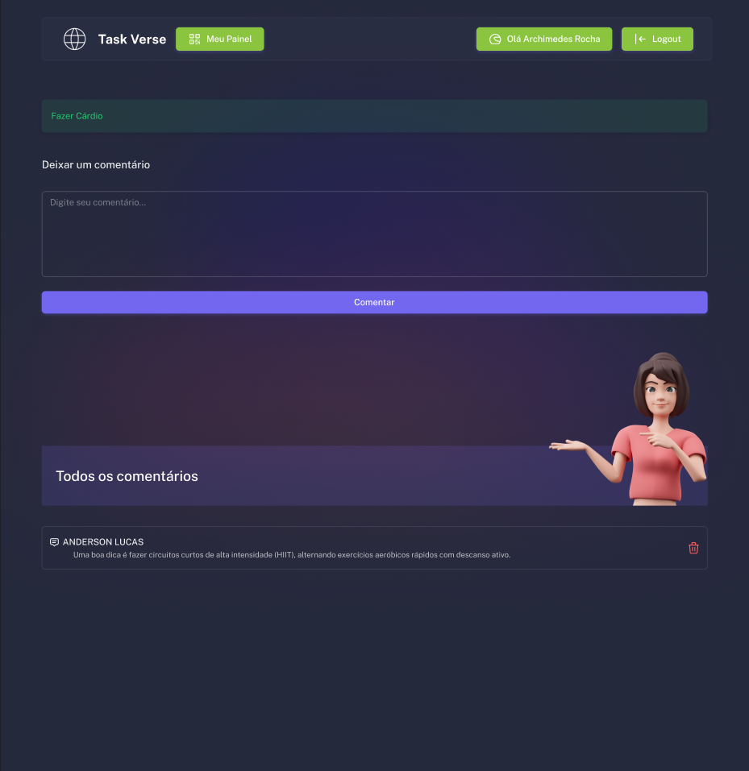

### Page Home


### Page Home Redesign


### Page Painel 


### Page Painel Redesign


### Page Comentários 


### Page Comentários Redesign


### Shortcuts

<p align="left">
 <a href="#título-do-projeto">Título do Projeto</a> •
 <a href="#resumo">Resumo</a> • 
 <a href="#status-do-projeto">Status do Projeto</a> • 
 <a href="#features">Features</a> • 
 <a href="#pré-requisitos">Pré-requisitos</a> • 
 <a href="#rodando-o-projeto">Rodando o Projeto</a> • 
 <a href="#autor">Autor</a> • 
 <a href="#mit-license">Licença</a>
</p>

### Título do Projeto

Task Verse

### Resumo

Este projeto é uma aplicação web desenvolvida em Next.js que permite ao usuário gerenciar suas tarefas de forma prática e organizada. A aplicação oferece funcionalidades como autenticação de usuários, criação, edição e exclusão de tarefas, bem como a possibilidade de adicionar comentários e visualizar detalhes de cada tarefa. Durante o desenvolvimento, foram aplicados conceitos como componentização, gerenciamento de estado com hooks, integração com a API do Firebase e estilização com styled-components.

### Status do Projeto

<h4 align="left"> 
	🚧 Task Verse 🚀 Concluído 🚧
</h4>

### Features

- [x] Autenticação de usuários com NextAuth
- [x] Criação e gerenciamento de tarefas
- [x] Comentários em tarefas
- [x] Estilização responsiva com styled-components
- [x] Integração com Firebase para armazenamento de dados

### Pré-requisitos

Antes de começar, você vai precisar ter instalado em sua máquina as seguintes ferramentas: 
- [Git](https://git-scm.com) 
- [Node.js](https://nodejs.org/en/)

Além disso, é bom ter um editor para trabalhar com o código, como o [VSCode](https://code.visualstudio.com/).

### Rodando o Projeto

```bash
# Clone este repositório
$ git clone <https://github.com/SeuUsuario/task-verse>

# Acesse a pasta do projeto no terminal/cmd
$ cd task-verse

# Instale as dependências
$ npm install

# Execute a aplicação em modo de desenvolvimento
$ npm run dev

# O servidor iniciará na porta:3000 - acesse <http://localhost:3000>

# Agora acesse seu firebase e configure no seu .env as suas variáveis de ambiente.
